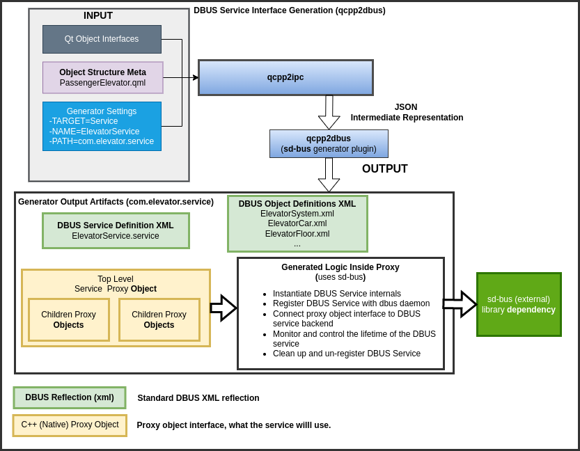

# **qcpp2ipc**
This tool utilizes the [Qt Meta Object](https://doc.qt.io/qt-6/metaobjects.html) system to generate interprocess communication backends that are modeled using object interfaces and properties. [Signals/Slots](https://doc.qt.io/qt-6/signalsandslots.html) model asynchronous IPC communication concepts.

The object model is enhanced with meta information and fed into qcpp2ipc with further control passed onto the output plugin through its own configuration data. The qcpp2ipc  tool then becomes a (latent) part of a build process.

### **Documentation**
- [`Software Requirements`](docs/SW_Requirements.MD)
- [`Software Architecture and Design`](docs/SW_Architecture_And_Design.MD)

## **Examples**
- [Elevator Example](examples/elevator/README.MD)

Using this Elevator Example for context - below is a demonstration of using qcpp2ipc to produce an ElevatorSystem DBUS service.
The physical system will not use DBUS and will consist of processes running on separate device boundaries. The DBUS implementation, allows for testing the logic within the separate processes on a single development machine (including unit tests).



Using the generation process, developers can select different IPC protocols/techniques for a deployment with very low overhead. More commonly, a team will create their own plugin that generates cusom IPC layers that match their business needs. Overall, the decoupling of interprocess communication layers can lead to a better developer experience and a more thoroughly tested codebase.


### **Code Owner**
[@PR-CDEAN](https://github.com/PR-CDean)
```
Christopher Dean
Productive Resources
Qt Specialist, Individual Contributor
Contact:
Cdean (at) productiveresources dot com
```

### **License**
qcpp2ipc is licensed under [MIT](LICENSE)

Contributions wanted!