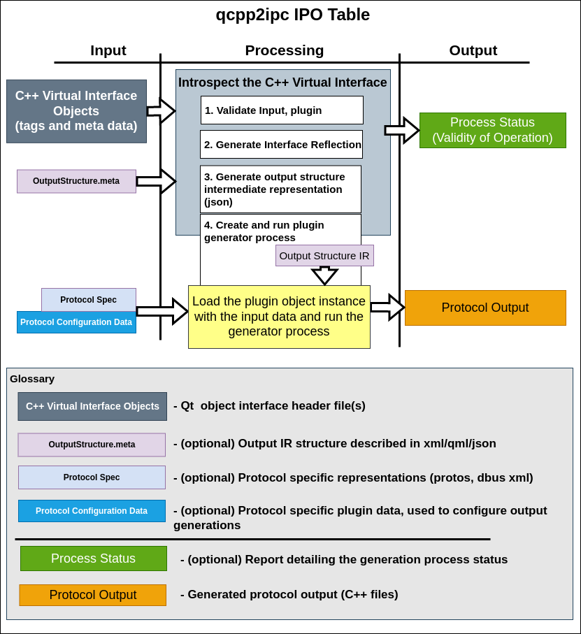

## **qcpp2ipc** - An IPC generation Tool
Saving thousands of hours (and dollars) through code generation.

## **General**
---

This tool utilizes the [Qt Meta Object](https://doc.qt.io/qt-6/metaobjects.html) system to generate interprocess communication backends that are modeled using object interfaces and properties. [Signals/Slots](https://doc.qt.io/qt-6/signalsandslots.html) model asynchronous IPC communication concepts.

The classes are enhanced with meta information and fed into qcpp2ipc with further control passed onto the output plugin through its own meta data. The qcpp2ipc  tool then becomes a (latent) part of a build process.

## **Examples**
- [Elevator Example](examples/elevator/README.MD)