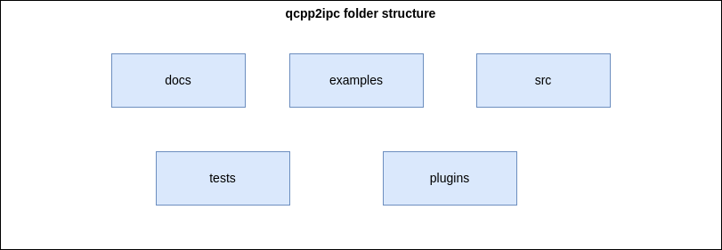
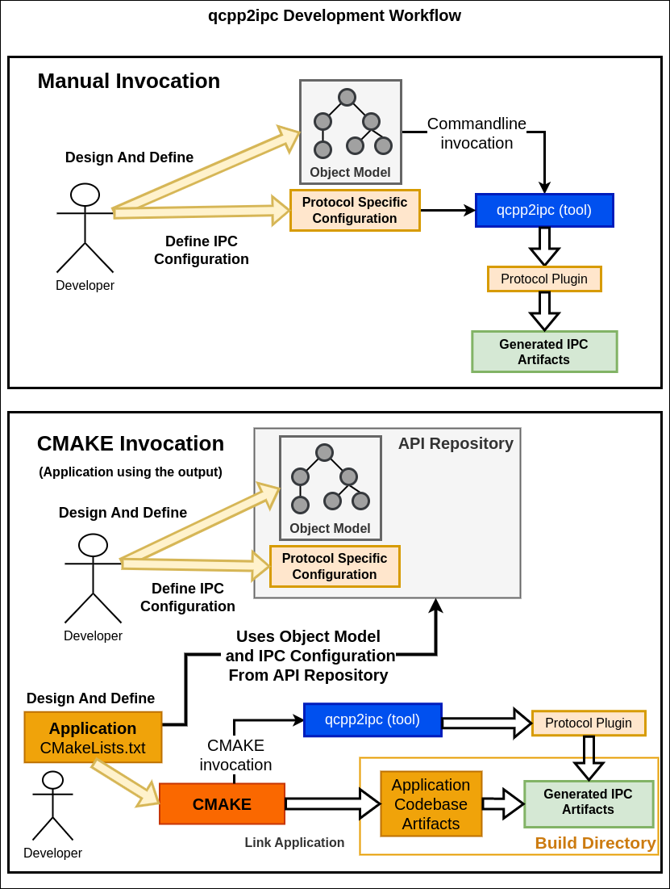
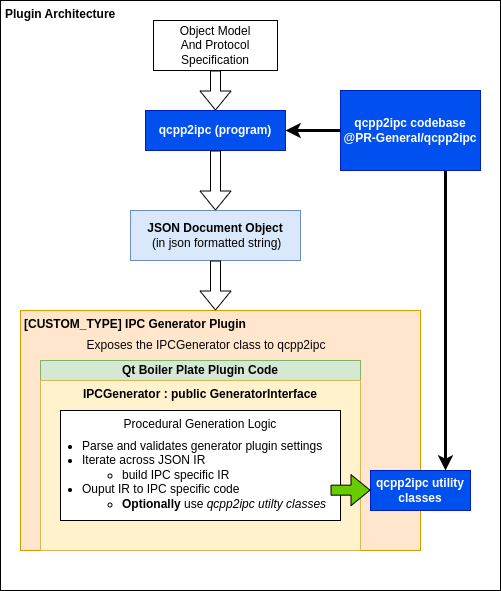

 # **qcpp2ipc Software Architecture and Design** [DRAFT]
 ### **Folder Structure**
The project folder structure encourages documentation under the **docs** folder and open source plugin implementations under **plugins** (tbd). Tests will be found under the **tests** folder and will target the codebase found under the **src** directory. User examples that illustrate using the tool will be found under **examples** 

- `[docs]` - project documentation
- `[examples]` - user examples
- `[src]` - qcpp2ipc codebase
- `[tests]` - test cases for requirement verification
- `[plugins]` - open source (reference) plugin implementations

### **Software Design**
The design builds on existing software concepts familiarized in the Qt software development tool chain (moc, qdbusxml2cpp). The software produces a commandline tool and a handful of utility classes to help generate code or object reflections. The commandline tool provides a configurable process using commandline parameters. The tool can be used directly by a **developer** or as part of their software build system.

### **The combination of the Qt object inerfaces and the output structure meta produce the *object model***.

The commandline frontend combined with introspective processing, sets up a generic pipeline for classifying and describing object interfaces. To produce an object intermediate representation in json relies heavily on the [**moc**](https://doc.qt.io/qt-6/moc.html) tool in the Qt Development toolchain.The tool provides the ability to reflect the QObject interfaces (C++) directly to json.
The json IR describes the objects themselves while the output structure meta (xml, json, or qml) describes the structure and relationship of the objects. 

### **Software Architecture**
The commandline process and even xml,json, and qml file reading is handled by Qt provided classes. The difficulties of multiplatform file, parsing, and even error checking is handled by
- [Qt Json Classes](https://doc.qt.io/qt-6/json.html)
- [Qt Xml Classes](https://doc.qt.io/qt-6/qtxml-module.html)
- [Qt Qml Engine](https://doc.qt.io/qt-6/qqmlengine.html)

The bulk of the software architecture is related to the generator plugin system.

### **Class Models (WIP)**
