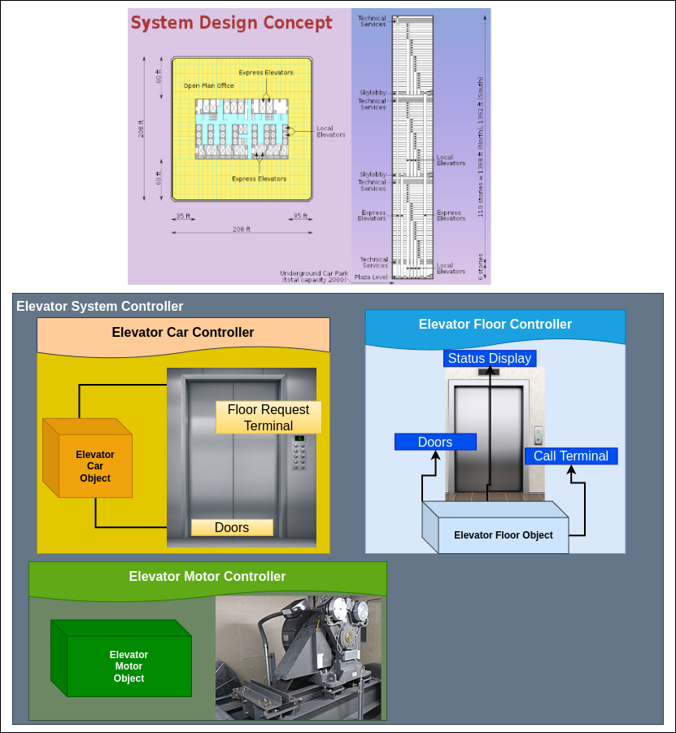
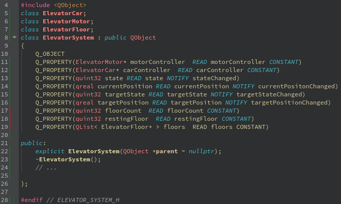
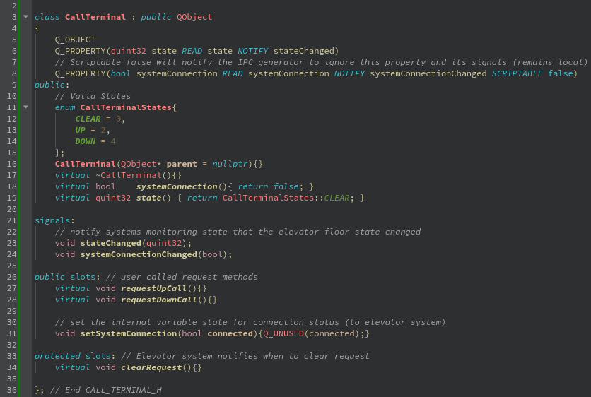

 
## **Elevator Example**
Following is an example of a real world system that might use IPC to connect multiple networked systems.



Above is a basic block diagram that illustrates the object structure for a Passenger Elevator System. The structure is often described to *qcpp2ipc* using json or qml.
## **Object Hiearchy**
The design consists of a main system controller, an elevator Car controller, an elevator Motor controller, and 1 to many elevator Floor controllers. Those parent controllers also include object inerfaces for sub controllers like doors, or call terminal interfaces.

### Output Structure - (optional) **PassengerElevator.qml**
```js
    ElevatorSystem{ // top level domain
        floorCount:6    // Constant floorCount (6)
        restingFloor:1  // Rest on Lobby floor

        ElevatorCar{ // car controller
            id: carController
            Doors{
                id:elevatorDoors
            }
            FloorRequestTerminal{
                id:floorRequestTerminal
            }
        }

        ElevatorMotor{ // motor controller
            id:motorController
        }

        ElevatorFloor{ // basement floor controller
            id:basement  
            name:"Basement"          
            Doors{
                id: basementDoors
            }
            CallTerminal{
                id:basementTerminal
            }
            StatusDisplay{
                id:basementStatus
            }
        }

        ElevatorFloor{ // lobby floor controller
            id:lobby            
            name:"Lobby" 
            Doors{
                id:lobbyDoors
            }
            CallTerminal{
                id:lobbyTerminal
            }
            StatusDisplay{
                id:lobbyStatus
            }
        }
        // ...
    }
```

### **Elevator Details**
Inside the controller exists further object structure. For instance, both the elevator car and each floor has a set of doors. The elevator system controller will coordinate between systems, bringing the elevator to a complete stop at the target floor. Then, synchronizing the opening of the elevator and floor doors to allow passengers to enter or exit the car.

### **Object Interfaces**
Each individual controller is connected to a networked bus. The controller API (object interface) is described and accessed through the bus. The system will utilize the generated code to communicate asynchronously between devices. Each device knows about the API and the IPC type (protocol + transport).

-  ElevatorSystem.h => ElevatorSystem 
-  FloorRequestTerminal.h => FloorRequestTerminal 
-  ElevatorCar.h => ElevatorCar 
-  ElevatorFloor.h => ElevatorFloor  
-  CallTerminal.h => CallTerminal 
-  Doors.h => Doors  
-  etc... 

- `Elevator System Controller:` The elevator system controller is the master coordinating controller. Through this interface, applications and other processes may interact with the Elevator System (service).
- `Elevator Car Controller:` Encapsulates the properties of an elevator car. Sub interfaces such as Car.Doors and Car.FloorRequestTerminal allow access to children object interfaces. A real world elevator system usually has mutliple cars; their naming and object interfaces might be used like:
- `Elevator Floor Request Terminal:` The elevator car contains a terminal for the user to request a destination floor as well as interact/view the status of the car and journey. Multiple floors may be selected simultaneously; the elevator system will route the elevator car to the appropriate floor.
- `Elevator Floor Controller:` An object structure that represents the elevator entryway for each floor. The floor's doors will remain shut while a car is not present to prevent passenger or cargo from falling inside the open shaft. The user interacts with the floor's CallTerminal, allowing an elevator to be called to a floor and what direction the passenger or cargo would like to travel.
- `Elevator Call Terminal:` A HMI that notifies the Elevator System of a user request for an Elevator car. This request also notifies the system of the users intended direction to optimize car routing.
- `Elevator Status Display:` A read only display, per floor, that notifies users of the current status of the (called) elevator car.
- `Elevator Doors:` Doors open simultaneously and contain minimal state and logic; intended to be driven by a higher level controller.

### **Demonstration of object interfaces**
```js
    // User requests elevator car on floor 5, going up
    Floor[5].CallTerminal.requestUpCall();

    // In StatusDisplay on floor[5], the current elevator status is displayed
    let floorName = ElevatorSystem.floorName(ElevatorSystem.PassengerCar.currentFloor());
    Floor.StatusDisplay.printMessage("Arriving at " + floorName);
    // displays "Arriving at Lobby"
    // Some time later the elevator car arrives at floor five, and lets the passenger board.
    // In PassengerCar.FloorRequestTerminal, user requests floor 8
    this.FloorRequestTerminal.requestFloor(8);


    //Below is an example of handling the request

    Connections{ // In ElevatorSystem
        // freight elevator example, with a load sensor
        target: FreightCar.FloorRequestTerminal
        function onRequestFloor(floor:int) =>{ // callback
            // read from load sensor
            let freightWeight = FrieghtCar.calculateFreightWeight();
            if(freightWeight >= FreightCar.maximumWeightLimit) {
                FreightCar.FloorRequestTerminal.displayWarning(ElevatorSystem.overweightWarning());
                FreightCar.Doors.lockOpen();
            }else {
                FreightCar.Doors.releaseLock();
                FreightCar.setTargetFloor(floor);
                FreightCar.Doors.notifyClosing();
                FreightCar.Doors.attemptClose();
                // ...
            }
        }
    }
```

### **Properties Defined in C++**
The Object interface describes its properties using the Q_PROPERTY macro. This example is simple but the macro can define the details of a property, like read/write access or even flags for the protocol (plugin) to utilize for generation.



Properties marked with a NOTIFY signal the property can change at any moment. Systems interested in monitoring this change can register a callback.

### **Remote Procedure Calls**
Often an interface cannot be described by properties alone. The qccp2ipc turns signal and slot definitions into bidirectional RPC. Signals are relayed to anyone listening for them, public slots are local functions, protected slots are turned into remote procedure calls (invoked remotely).



The methods are marked virtual so this interface can be inherited from and used for a derived solution. The concrete class will contain real code to perform when a remote procedure is called.